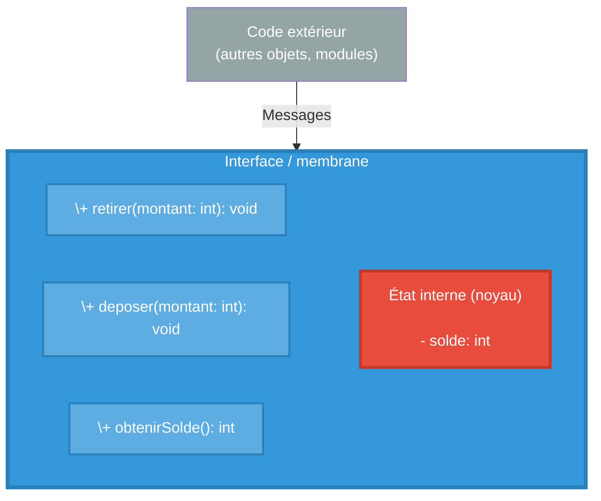
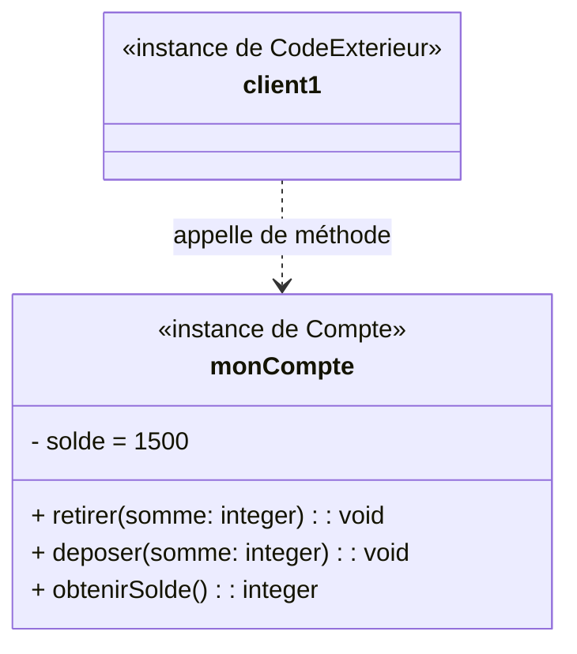

# Qu'est ce que l'encapsulation ? En quoi nous aide-t-elle ?

On va maintenant encapsuler les données du compte. Si on reprend l'analogie d'Alan Kay, on va placer les données dans le noyau d'une cellule, ces données ne seront pas directement accessible à partir de l'extérieur de la cellule. Il faudra passer par la membrane.

Cette membrane est l'interface entre l'intérieur et l'exérieur de la cellule, tout comme en biologie, elle va conditionner les échanges entre l'intérieur et l'extérieur. On dit que l'extérieur envoie des messages vers la cellule, la membrane définie les messages qui sont compris par la cellule. En termes programmation par objet cela se traduit ainsi : *"L'objet définie une interface de communication avec l'extérieur sous la forme de méthodes, les autres objets peuvent communiquer avec lui en appelant ces méthodes*.

Vous avez probablement déjà noté que ces méthodes ressemblent beaucoup aux fonctions que nous avons vu précédemment pour la version en C. La différence réside dans le fait que les méthodes sont liées à l'objet, elles sont les seules à pouvoir accéder aux données qui sont encapsulées dans l'objet. C'est sur elles que va reposer le maintient de la cohérence des données (l'état interne de l'objet).

Grâce à ce mécanisme d'encapsulation, il n'est plus possible d'accéder directement à l'état interne (ici le solde). On ne peut plus le modifier accidentellement. Les seules modifications possibles le sont via les méthodes de l'objet et c'est à ces dernières d'assurer la cohérence des données et des opérations qui leurs sont appliquées (ex: vérifier qu'on a un solde suffisant pour retirer de l'argent).

On peut reprendre le schéma précédent pour le traduire dans une syntaxe graphique plus usitée en programmation objet : le diagramme d'objet. Cela donne le diagramme ci dessous :

On représente l'objet avec trois partie : son nom, la liste de ses attributs (qui codent son état interne) et liste de ses méthodes (son interface vis à vis de l'extérieur, sa membrane). 

On note qu'il est indiqué que l'objet **`monCompte`** est une instance de **`Compte`**. Dans les langages à objet comme Java, les objets sont toujours instances d'une classe. Une classe est un modèle (ou "plan de construction") qui définit la structure et le comportement communs d'un ensemble d'objets. Elle spécifie :

* Les attributs (données) que possèderont les objets (ici le solde)
* Les méthodes (comportements) que pourront exécuter les objets (ici retirer, déposer et obtenirSolde)

Par analogie, on pourrait dire que la classe est le plan d'architecte d'une maison là où les objets instances de cette classes sont les maisons réelles construites à partir de ce plan.