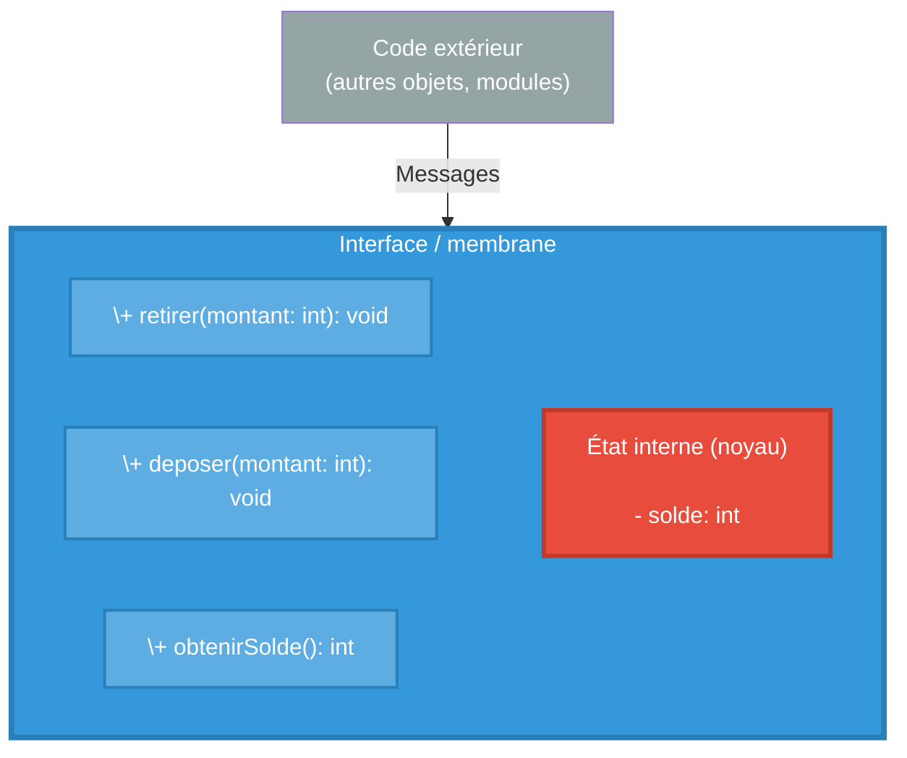
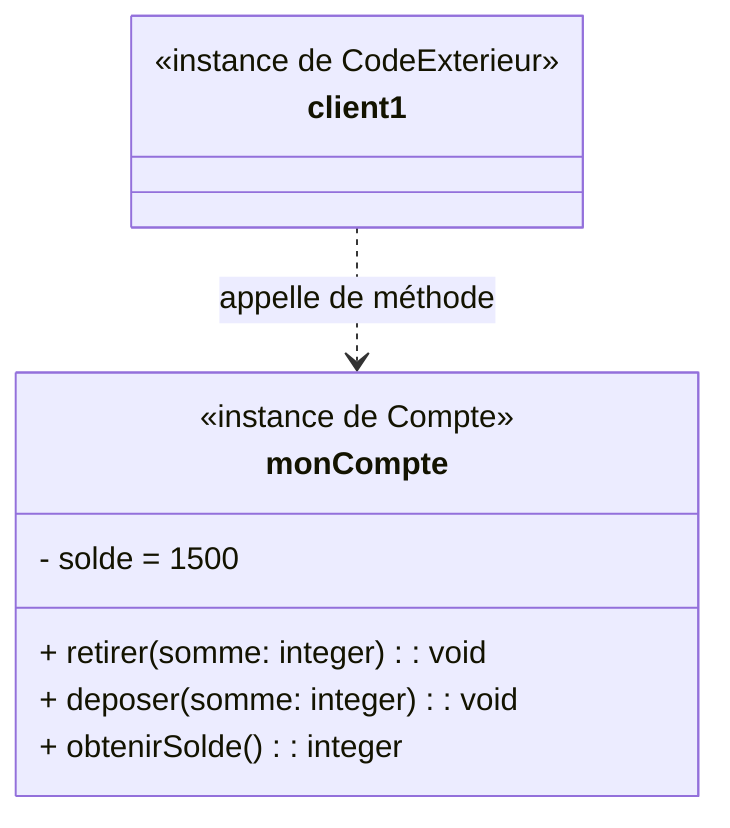

# Pourquoi utilise-t-on la programmation orientée objet ?

## Le contexte historique : un problème de complexité

Dans les années 1960, les programmeurs faisaient face à un problème majeur : la gestion et la maintenance du code devenaient un cauchemar à mesure que les logiciels se complexifiaient. Avec la programmation procédurale (Fortran, COBOL, C), les données et les fonctions étaient séparées, ce qui signifiait que les changements dans une partie du code pouvaient perturber une autre partie.

C'est dans ce contexte qu'en Norvège, deux chercheurs, Ole-Johan Dahl et Kristen Nygaard, créent Simula entre 1961 et 1967. Leur objectif initial était de simuler le mouvement de navires dans des ports. Ce langage a introduit des mécanismes fondamentalement nouveaux : le concept de classe pour l'encapsulation de la structure des données et du code, les sous-classes pour la réutilisation du code, et la création dynamique d'objets.

## Le concept d'encapsulation

L'encapsulation est **le concept central** de la programmation objet.

### L'analogie d'Alan Kay

Alan Kay, qui a popularisé le terme "programmation orientée objet" en 1966-1967, pensait aux objets comme à des cellules biologiques ou des ordinateurs individuels sur un réseau, capables uniquement de communiquer par messages. Dans une interview ultérieure, Kay a précisé que pour lui, la POO signifiait "seulement la messagerie, la rétention et protection locale de l'état, et le masquage de l'état-processus".

### Un exemple : Compte bancaire

Supposons qu'on veuille développer un compte bancaire. En programmation procédurale, sans objet, on pourrait écrire par exemple le code suivant pour gérer un compte (retrait, dépôt) :

```c
/* fichier: compte.c - Style procédural PROBLÉMATIQUE */

int solde = 1000;

void retirer(int montant) {
    if (solde >= montant) {
      solde -= montant;
    }
}

void deposer(int montant) {
    solde += montant;
}
```

Les fonctions `retirer` et `deposer` que nous avons définies gèrent l'accès au solde du compte. En particulier, la fonction `retirer` vérifie que le solde est suffisant pour le retrait. Le problème est que la variable `solde` n'est pas protégée, c'est à dire que depuis un autre fichier, on pourrait facilement la modifier sans passer par les fonctions. Par exemple :
```c
/* Dans n'importe quel autre fichier du projet : */
extern float solde;  /* Accessible partout ! */

void fonction_malveillante() {
    solde = -5000.0;  /* CATASTROPHE : personne ne peut l'empêcher */
}
```

### Résumons les problèmes
- N'importe quelle partie du programme peut accéder et modifier `solde_compte`
- Les données sont complètement exposées en lecture et surtout en écriture
- Aucun moyen de garantir la cohérence des données
## Avec l'encapsulation

On va maintenant encapsuler les données du compte. Si on reprend l'analogie d'Alan Kay, on va placer les données dans le noyau d'une cellule, ces données ne seront pas directement accessible à partir de l'extérieur de la cellule. Il faudra passer par la membrane.

Cette membrane est l'interface entre l'intérieur et l'exérieur de la cellule, tout comme en biologie, elle va conditionner les échanges entre l'intérieur et l'extérieur. On dit que l'extérieur envoie des messages vers la cellule, la membrane définie les messages qui sont compris par la cellule. En termes programmation par objet cela se traduit ainsi : *"L'objet définie une interface de communication avec l'extérieur sous la forme de méthodes, les autres objets peuvent communiquer avec lui en appelant ces méthodes*.




Vous avez probablement déjà noté que ces méthodes ressemblent beaucoup aux fonctions que nous avons vu précédemment pour la version en C. La différence réside dans le fait que les méthodes sont liées à l'objet, elles sont les seules à pouvoir accéder aux données qui sont encapsulées dans l'objet. C'est sur elles que va reposer le maintient de la cohérence des données (l'état interne de l'objet).

On peut reprendre le schéma précédent pour le traduire dans une syntaxe graphique plus usitée en programmation objet : le diagramme d'objet. Cela donne le diagramme ci dessous :



On représente l'objet avec trois partie : son nom, la liste de ses attributs (qui codent son état interne) et liste de ses méthodes (son interface vis à vis de l'extérieur, sa membrane). 

On note qu'il est indiqué que l'objet **`monCompte`** est une instance de **`Compte`**. Dans les langages à objet comme Java, les objets sont toujours instances d'une classe. Une classe est un modèle (ou "plan de construction") qui définit la structure et le comportement communs d'un ensemble d'objets. Elle spécifie :

* Les attributs (données) que possèderont les objets (ici le solde)
* Les méthodes (comportements) que pourront exécuter les objets (ici retirer, déposer et obtenirSolde)

Par analogie, on pourrait dire que la classe est le plan d'architecte d'une maison là où les objets instances de cette classes sont les maisons réelles construites à partir de ce plan.


## Conclusion sur l'encapsulation
L'encapsulation n'est pas qu'un détail technique : c'est une philosophie de conception qui dit "regroupons les données avec les opérations qui les manipulent, protégeons l'état interne, et communiquons par interfaces bien définies". 

En C procédural, les données globales et les fonctions sont séparées, exposées, vulnérables. En Java (et dans les langages objets en général), les mécanismes d'encapsulation sont directement intégrés au langage avec les modificateurs d'accès (`private`, `public`, `protected`).