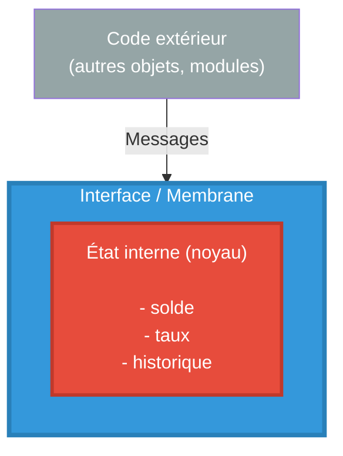
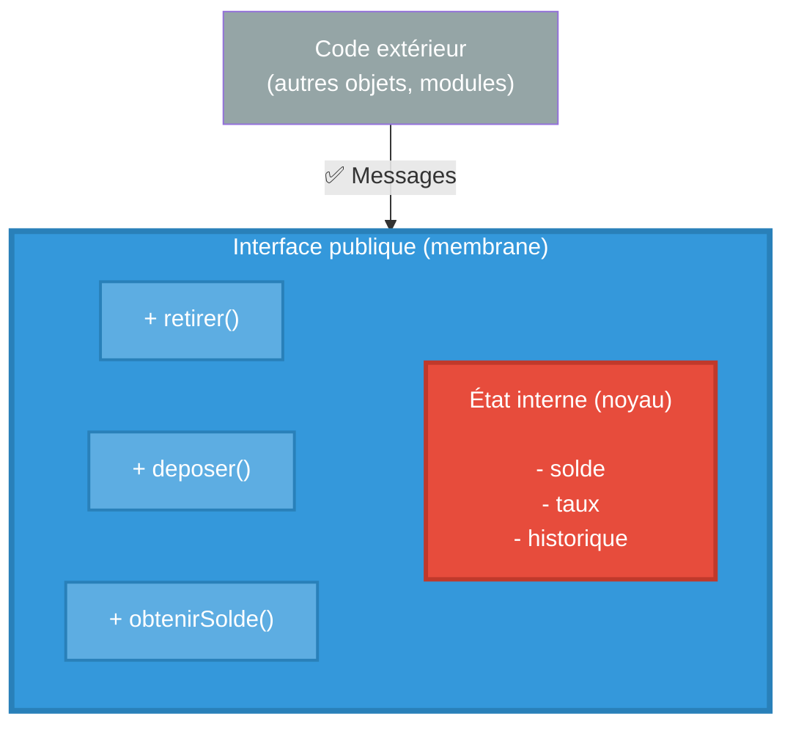

# Pourquoi utilise-t-on la programmation orientée objet ?

## Le contexte historique : un problème de complexité

Dans les années 1960, les programmeurs faisaient face à un problème majeur : la gestion et la maintenance du code devenaient un cauchemar à mesure que les logiciels se complexifiaient. Avec la programmation procédurale (Fortran, COBOL, C), les données et les fonctions étaient séparées, ce qui signifiait que les changements dans une partie du code pouvaient perturber une autre partie.

C'est dans ce contexte qu'en Norvège, deux chercheurs, Ole-Johan Dahl et Kristen Nygaard, créent Simula entre 1961 et 1967. Leur objectif initial était de simuler le mouvement de navires dans des ports. Ce langage a introduit des mécanismes fondamentalement nouveaux : le concept de classe pour l'encapsulation de la structure des données et du code, les sous-classes pour la réutilisation du code, et la création dynamique d'objets.

## Le concept d'encapsulation

L'encapsulation est **le concept central** de la programmation objet.

### L'analogie d'Alan Kay

Alan Kay, qui a popularisé le terme "programmation orientée objet" en 1966-1967, pensait aux objets comme à des cellules biologiques ou des ordinateurs individuels sur un réseau, capables uniquement de communiquer par messages. Dans une interview ultérieure, Kay a précisé que pour lui, la POO signifiait "seulement la messagerie, la rétention et protection locale de l'état, et le masquage de l'état-processus".

### Un exemple : Mini système bancaire

Supposons qu'on veuille développer un mini système bancaire. En programmation procédurale, sans objet, on pourrait écrire par exemple le code suivant pour gérer un compte (retrait, dépôt, intérêts) :

```c
/* fichier: compte.c - Style procédural PROBLÉMATIQUE */

float solde_compte = 1000.0;
float taux_interet = 0.02;

void retirer_argent(float montant) {
    solde_compte -= montant;  /* N'importe qui peut appeler ça ! */
    /* Aucune vérification du solde ! */
}

void calculer_interets() {
    solde_compte += solde_compte * taux_interet;
}

void deposer_argent(float montant) {
    solde_compte += montant;
}
```

Le problème est que les données ainsi définies ne sont pas bien protégées, c'est à dire que depuis un autre fichier, on pourrait facilement les modifier sans que le concepteur de ces fonctions et données ne puisse l'epécher. Par exemple :
```c
/* Dans n'importe quel autre fichier du projet : */
extern float solde_compte;  /* Accessible partout ! */

void fonction_malveillante() {
    solde_compte = -5000.0;  /* CATASTROPHE : personne ne peut l'empêcher */
}

void autre_fonction() {
    retirer_argent(10000.0);  /* Aucune vérification ! Solde négatif ! */
}
```

### Résumons les problèmes
- N'importe quelle partie du programme peut accéder et modifier `solde_compte`.
- Impossible de garantir qu'on ne retire pas plus que le solde disponible
- Si 50 fonctions utilisent `solde_compte`, un bug peut venir de n'importe où
- Les données sont complètement exposées en lecture et surtout en écriture
- Aucun moyen de garantir la cohérence des données
## Avec l'encapsulation

On va maintenant encapsuler les données du compte. Si on reprend l'analogie d'Alan Kay, on va placer les données dans le noyau d'une cellule, ces données ne seront pas directement accessible à partir de l'extérieur de la cellule. Il faudra passer par la membrane.

Cette membrane est l'interface entre l'intérieur et l'exérieur de la cellule, tout comme en biologie, elle va conditionner les échanges entre l'intérieur et l'extérieur.







<br/><br/><br/><br/><br/><br/><br/><br/><br/>


_________
XXXX
_________


### Les avantages fondamentaux de l'encapsulation

L'encapsulation permet à un objet de ressembler à une unité autonome ayant ses propres capacités, et pouvant être sollicitée pour effectuer des services par d'autres unités.

**1. Protection des données**
- Les données internes sont cachées (modificateur `private` en Java)
- Seules les méthodes de la classe peuvent les modifier
- Le compilateur empêche les accès directs non autorisés
- Impossible de mettre l'objet dans un état incohérent

**2. Gestion de la complexité**
Les langages orientés objet aident à gérer la complexité dans les grands programmes en regroupant les données et les opérations qui s'y appliquent, de sorte que seules les opérations soient accessibles publiquement.

**3. Modularité et maintenance**
L'encapsulation organise le code de sorte que seules certaines parties des données soient utilisées par des fonctions connexes, ce qui facilite la modification du fonctionnement interne d'un objet sans affecter d'autres parties du code.

### Un exemple concret : pourquoi c'est puissant

Supposons que vous devez ajouter une fonctionnalité : enregistrer toutes les transactions dans un historique. 

**Avec l'encapsulation en Java :**

```java
import java.util.ArrayList;
import java.util.List;

public class CompteBancaire {
    private double solde;
    private double taux;
    private List<String> historique;  // NOUVEAU !
    
    public CompteBancaire() {
        this.solde = 1000.0;
        this.taux = 0.02;
        this.historique = new ArrayList<>();  // NOUVEAU !
    }
    
    public boolean retirer(double montant) {
        if (montant <= this.solde) {
            this.solde -= montant;
            // Ajout dans l'historique ICI seulement
            this.historique.add("Retrait: " + montant);  // NOUVEAU !
            return true;
        }
        return false;
    }
    
    public void deposer(double montant) {
        if (montant > 0) {
            this.solde += montant;
            this.historique.add("Dépôt: " + montant);  // NOUVEAU !
        }
    }
    
    public double obtenirSolde() {
        return this.solde;
    }
    
    // Nouvelle méthode publique
    public void afficherHistorique() {
        for (String transaction : this.historique) {
            System.out.println(transaction);
        }
    }
}
```

**Le miracle** : tout le code existant qui utilise `CompteBancaire` continue de fonctionner sans aucune modification ! Les classes `GestionFactures`, `GestionBonus`, `Main` et toutes les autres n'ont pas besoin d'être touchées. L'historique est automatiquement rempli.

**En C procédural, il faudrait :**
- Ajouter une variable globale `char historique[100][50]`
- Modifier TOUTES les fonctions qui touchent au solde
- Espérer n'avoir rien oublié
- Risquer d'oublier d'enregistrer une transaction quelque part

### Un autre exemple : changer l'implémentation interne

Supposons que vous vouliez stocker le solde en centimes (entier) plutôt qu'en euros (flottant) pour éviter les problèmes d'arrondi :

```java
public class CompteBancaire {
    private long soldeEnCentimes;  // Changement interne !
    private double taux;
    
    public CompteBancaire() {
        this.soldeEnCentimes = 100000;  // 1000.00 euros en centimes
        this.taux = 0.02;
    }
    
    public boolean retirer(double montant) {
        long montantCentimes = (long)(montant * 100);
        if (montantCentimes <= this.soldeEnCentimes) {
            this.soldeEnCentimes -= montantCentimes;
            return true;
        }
        return false;
    }
    
    public double obtenirSolde() {
        return this.soldeEnCentimes / 100.0;  // Conversion transparente
    }
}
```

**Résultat** : vous avez changé complètement la représentation interne des données, mais aucun code utilisateur n'a besoin d'être modifié ! L'interface publique (les méthodes) reste identique.

### Conclusion

Au lieu de voir un programme comme une structure monolithique, le code d'un programme SIMULA était organisé en un certain nombre de classes et de blocs. Cette organisation naturelle reflète mieux le monde réel et offre une manière naturelle de modéliser les problèmes du monde réel, en permettant aux objets de refléter les éléments d'intérêt.

L'encapsulation n'est pas qu'un détail technique : c'est une philosophie de conception qui dit "regroupons les données avec les opérations qui les manipulent, protégeons l'état interne, et communiquons par interfaces bien définies". 

En C procédural, les données globales et les fonctions sont séparées, exposées, vulnérables. En Java (et dans les langages objets en général), les mécanismes d'encapsulation sont directement intégrés au langage avec les modificateurs d'accès (`private`, `public`, `protected`). Cette approche a permis de construire les systèmes logiciels complexes qui font fonctionner notre monde aujourd'hui : systèmes bancaires, applications web, systèmes embarqués critiques, tous bénéficient de cette protection et de cette modularité.