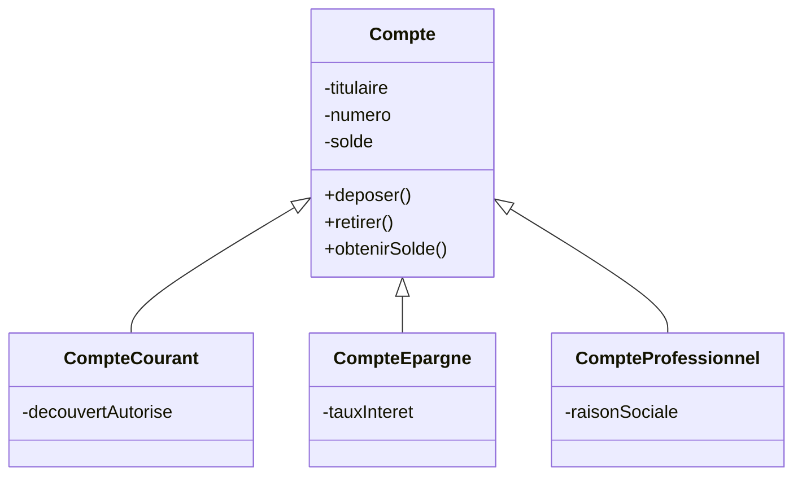
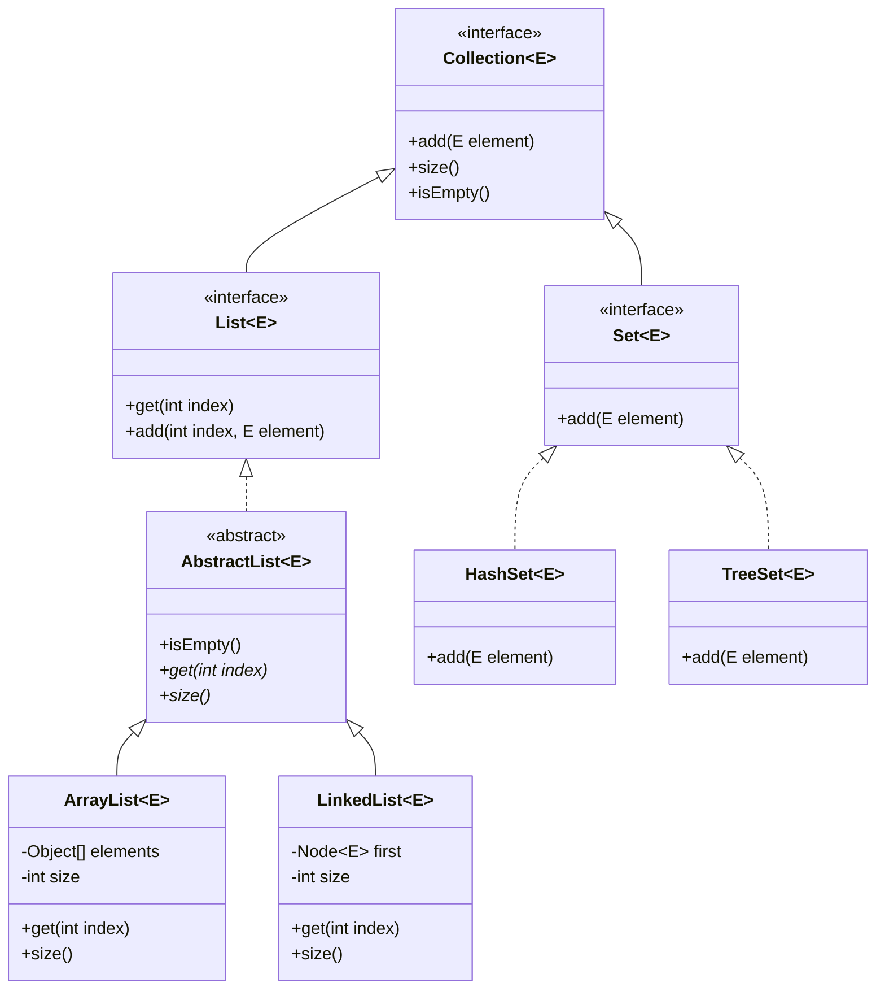
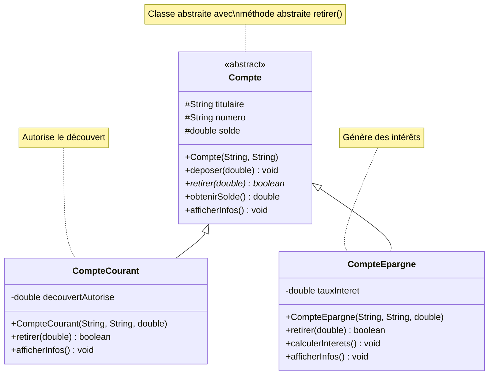
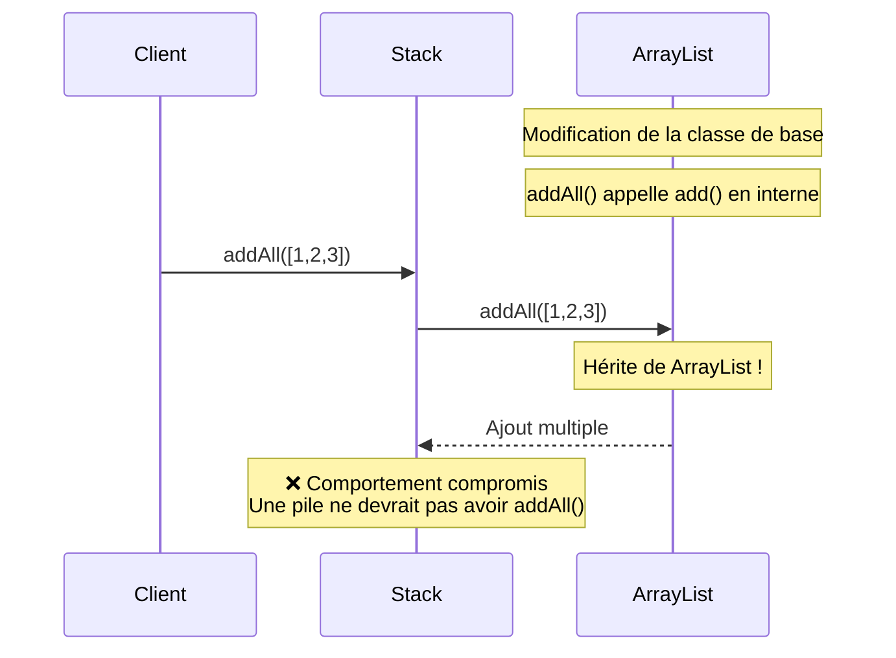
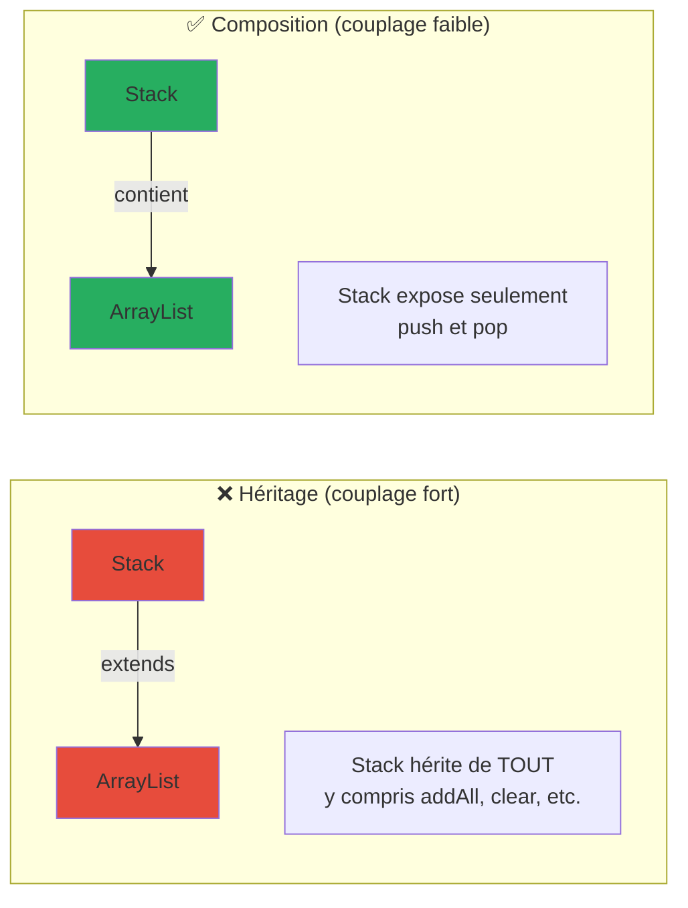
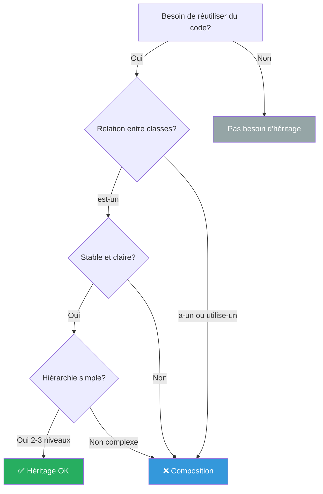

# L'héritage en programmation orientée objet

## Les origines : Simula 67 (1967)

L'héritage est né d'un besoin concret de réutilisation de code dans les simulations. En 1967, Ole-Johan Dahl et Kristen Nygaard ont présenté un concept permettant de spécifier des objets appartenant à différentes classes mais ayant des propriétés communes. Ces propriétés communes étaient regroupées dans une superclasse, et chaque superclasse pouvait elle-même avoir une superclasse (voir [la page Wikipedia dédiée](https://en.wikipedia.org/wiki/Simula) ou un [historique du langage Simula](https://users.dcc.uchile.cl/~cgutierr/cursos/LP/SimulaHistory.html) écrit par Jan Rune Holmevik).

## La raison d'être

XXX Ne pas répliquer le code, pouvoir considérer que COmpteCourant, ComptePargne et CompteProfesionnel sont tous des Comptes et les traiter en tant que tel.

L'héritage permet d'éviter cette duplication en créant une hiérarchie :



*Schéma 1 : Hiérarchie de comptes bancaires - évite la duplication des attributs communs*

## La notion d'héritage : définition et mécanisme

### Définition

L'**héritage** est un mécanisme qui permet à une classe (appelée **sous-classe** ou **classe dérivée**) de récupérer automatiquement les attributs et méthodes d'une autre classe (appelée **superclasse** ou **classe de base**).

**Relation exprimée :** "est-un" (is-a)
- Un CompteCourant **est un** Compte
- Un Chien **est un** Animal
- Une ArrayList **est une** List

### Principe fondamental

L'héritage permet aux programmeurs de créer des classes qui sont construites sur des classes existantes, de spécifier une nouvelle implémentation tout en maintenant les mêmes comportements, de réutiliser du code et d'étendre de manière indépendante un logiciel via des classes et interfaces publiques [2].

## Exemples en Java : l'API Collections

L'API Collections de Java est un excellent exemple d'utilisation judicieuse de l'héritage. Examinons la hiérarchie :



*Schéma 3 : Hiérarchie simplifiée de l'API Collections Java*

### Exemple 1 : Hiérarchie List

```java
// Interface de base : définit le contrat
public interface List<E> extends Collection<E> {
    boolean add(E element);
    E get(int index);
    int size();
    // ... autres méthodes
}

// Classe abstraite qui implémente des méthodes communes
public abstract class AbstractList<E> implements List<E> {
    // Implémentation par défaut de certaines méthodes
    public boolean isEmpty() {
        return size() == 0;  // Réutilisé par toutes les sous-classes
    }
    
    // Méthodes abstraites à implémenter par les sous-classes
    public abstract E get(int index);
    public abstract int size();
}

// Implémentation concrète : ArrayList
public class ArrayList<E> extends AbstractList<E> {
    private Object[] elements;
    private int size;
    
    // Implémentation spécifique avec un tableau dynamique
    @Override
    public E get(int index) {
        if (index >= size) {
            throw new IndexOutOfBoundsException();
        }
        return (E) elements[index];
    }
    
    @Override
    public int size() {
        return size;
    }
    
    // Hérite automatiquement de isEmpty() de AbstractList !
}

// Implémentation concrète : LinkedList
public class LinkedList<E> extends AbstractList<E> {
    private Node<E> first;
    private int size;
    
    // Implémentation spécifique avec une liste chaînée
    @Override
    public E get(int index) {
        Node<E> current = first;
        for (int i = 0; i < index; i++) {
            current = current.next;
        }
        return current.data;
    }
    
    @Override
    public int size() {
        return size;
    }
    
    // Hérite aussi de isEmpty() de AbstractList !
}
```

**Avantages visibles ici :**
1. Le code de `isEmpty()` n'est écrit qu'une seule fois dans `AbstractList`
2. `ArrayList` et `LinkedList` héritent automatiquement de cette méthode
3. Si on améliore `isEmpty()`, toutes les sous-classes en bénéficient

### Exemple 2 : Polymorphisme grâce à l'héritage

Un des grands pouvoirs de l'héritage est le **polymorphisme** : traiter des objets de types différents de manière uniforme.

```java
public class GestionnaireCollections {
    
    // Cette méthode accepte N'IMPORTE QUELLE List !
    public static void afficherTaille(List<?> liste) {
        System.out.println("La liste contient " + liste.size() + " éléments");
    }
    
    public static void main(String[] args) {
        List<String> arrayList = new ArrayList<>();
        arrayList.add("Java");
        arrayList.add("Python");
        
        List<String> linkedList = new LinkedList<>();
        linkedList.add("C");
        linkedList.add("C++");
        
        // Même méthode pour les deux types !
        afficherTaille(arrayList);   // Fonctionne
        afficherTaille(linkedList);  // Fonctionne aussi
        
        // On peut même changer d'implémentation facilement
        List<Integer> nombres = new ArrayList<>();
        nombres.add(1);
        nombres.add(2);
        
        // Décision de changer pour une LinkedList ?
        nombres = new LinkedList<>(nombres);  // Facile !
    }
}
```

### Exemple 3 : Cas réel - Hiérarchie de comptes bancaires



*Schéma 4 : Diagramme UML de la hiérarchie des comptes bancaires*

```java
// Classe de base : comportement commun à tous les comptes
public abstract class Compte {
    protected String titulaire;
    protected String numero;
    protected double solde;
    
    public Compte(String titulaire, String numero) {
        this.titulaire = titulaire;
        this.numero = numero;
        this.solde = 0.0;
    }
    
    // Méthode commune à tous les comptes
    public void deposer(double montant) {
        if (montant > 0) {
            solde += montant;
            System.out.println("Dépôt de " + montant + " effectué");
        }
    }
    
    // Méthode abstraite : chaque type de compte a sa propre logique
    public abstract boolean retirer(double montant);
    
    public double obtenirSolde() {
        return solde;
    }
    
    public void afficherInfos() {
        System.out.println("Compte " + numero + " - Titulaire: " + titulaire);
        System.out.println("Solde: " + solde + " €");
    }
}

// Sous-classe : Compte Courant (avec découvert autorisé)
public class CompteCourant extends Compte {
    private double decouvertAutorise;
    
    public CompteCourant(String titulaire, String numero, double decouvert) {
        super(titulaire, numero);  // Appel au constructeur de la classe mère
        this.decouvertAutorise = decouvert;
    }
    
    @Override
    public boolean retirer(double montant) {
        // Logique spécifique : peut aller en négatif jusqu'au découvert
        if (solde - montant >= -decouvertAutorise) {
            solde -= montant;
            System.out.println("Retrait de " + montant + " effectué");
            return true;
        }
        System.out.println("Découvert dépassé !");
        return false;
    }
    
    @Override
    public void afficherInfos() {
        super.afficherInfos();  // Réutilise l'affichage de base
        System.out.println("Découvert autorisé: " + decouvertAutorise + " €");
    }
}

// Sous-classe : Compte Épargne (avec intérêts)
public class CompteEpargne extends Compte {
    private double tauxInteret;
    
    public CompteEpargne(String titulaire, String numero, double taux) {
        super(titulaire, numero);
        this.tauxInteret = taux;
    }
    
    @Override
    public boolean retirer(double montant) {
        // Logique spécifique : ne peut pas être négatif
        if (solde >= montant) {
            solde -= montant;
            System.out.println("Retrait de " + montant + " effectué");
            return true;
        }
        System.out.println("Solde insuffisant !");
        return false;
    }
    
    // Méthode spécifique au compte épargne
    public void calculerInterets() {
        double interets = solde * tauxInteret;
        solde += interets;
        System.out.println("Intérêts de " + interets + " € ajoutés");
    }
    
    @Override
    public void afficherInfos() {
        super.afficherInfos();
        System.out.println("Taux d'intérêt: " + (tauxInteret * 100) + "%");
    }
}

// Utilisation
public class BanqueApp {
    public static void main(String[] args) {
        // Polymorphisme : tableau de Compte contenant différents types
        Compte[] comptes = new Compte[2];
        comptes[0] = new CompteCourant("Alice Dupont", "CC001", 500.0);
        comptes[1] = new CompteEpargne("Bob Martin", "CE001", 0.03);
        
        // Opérations communes
        for (Compte compte : comptes) {
            compte.deposer(1000.0);  // Fonctionne pour tous
            compte.afficherInfos();   // Polymorphisme !
            System.out.println("---");
        }
        
        // Opérations spécifiques
        CompteCourant cc = (CompteCourant) comptes[0];
        cc.retirer(1400.0);  // Utilise le découvert
        
        CompteEpargne ce = (CompteEpargne) comptes[1];
        ce.calculerInterets();  // Méthode spécifique
    }
}
```

**Sortie du programme :**
```
Dépôt de 1000.0 effectué
Compte CC001 - Titulaire: Alice Dupont
Solde: 1000.0 €
Découvert autorisé: 500.0 €
---
Dépôt de 1000.0 effectué
Compte CE001 - Titulaire: Bob Martin
Solde: 1000.0 €
Taux d'intérêt: 3.0%
---
Retrait de 1400.0 effectué
Intérêts de 30.0 € ajoutés
```

## Les bénéfices de l'héritage

1. **Réutilisation du code** : Pas besoin de réécrire `deposer()`, `afficherInfos()`, etc. pour chaque type de compte.

2. **Extension facile** : Pour ajouter un nouveau type de compte (par exemple, `CompteJeune`), il suffit d'étendre `Compte` et de redéfinir les méthodes spécifiques.

3. **Maintenance simplifiée** : Si on doit changer la logique de `deposer()`, on ne la modifie qu'à un seul endroit : dans la classe `Compte`.

4. **Polymorphisme** : On peut traiter tous les comptes de manière uniforme via le type `Compte`, tout en conservant leurs comportements spécifiques.

## Les critiques modernes de l'héritage

### Le problème de la "classe de base fragile" (Fragile Base Class Problem)

Le principal problème avec l'héritage d'implémentation est qu'il introduit un couplage non nécessaire sous la forme du "problème de la classe de base fragile" : des modifications à l'implémentation de la classe de base peuvent causer des changements de comportement involontaires dans les sous-classes [3].



*Schéma 5 : Le problème de la classe de base fragile - modifications involontaires*

**Exemple du problème :**

```java
// Classe de base - Version 1
public class Stack<E> extends ArrayList<E> {
    public void push(E element) {
        add(element);
    }
    
    public E pop() {
        return remove(size() - 1);
    }
}

// On utilise Stack dans tout le projet...

// Quelqu'un modifie ArrayList (classe de base) :
// ArrayList ajoute une nouvelle méthode addAll() qui appelle add() en interne

// Maintenant, si quelqu'un fait :
Stack<Integer> stack = new Stack<>();
stack.addAll(Arrays.asList(1, 2, 3));  // Hérite de ArrayList !

// Le comportement de Stack est compromis car addAll() 
// n'est pas une opération valide pour une pile !
```

### La recommandation moderne : "Composition over Inheritance"

Les auteurs du livre Design Patterns recommandent plutôt l'héritage d'interface et favorisent la composition plutôt que l'héritage [4].



*Schéma 6 : Héritage vs Composition - la composition offre un meilleur contrôle*

**Alternative avec composition :**

```java
// Au lieu d'hériter, on CONTIENT une ArrayList
public class Stack<E> {
    private ArrayList<E> elements = new ArrayList<>();  // Composition !
    
    public void push(E element) {
        elements.add(element);
    }
    
    public E pop() {
        return elements.remove(elements.size() - 1);
    }
    
    public int size() {
        return elements.size();
    }
    
    // On expose UNIQUEMENT les méthodes qu'on veut !
    // addAll() n'est PAS accessible de l'extérieur
}
```

### James Gosling et Java

Il a été rapporté que James Gosling, l'inventeur de Java, s'est exprimé contre l'héritage d'implémentation, déclarant qu'il ne l'inclurait pas s'il devait reconcevoir Java [5].

## Quand utiliser l'héritage ?



*Schéma 7 : Arbre de décision - héritage ou composition ?*

### ✅ Utiliser l'héritage quand :

1. **Relation "est-un" claire et stable**
   - Un Chien **est un** Animal (ne changera jamais)
   - Une ArrayList **est une** List (relation fondamentale)

2. **Hiérarchie simple et peu profonde**
   - 2-3 niveaux maximum
   - Pas de modifications fréquentes de la classe de base

3. **Polymorphisme nécessaire**
   - Besoin de traiter des objets différents de manière uniforme
   - Frameworks et APIs publiques

### ❌ Éviter l'héritage quand :

1. **Relation "a-un" ou "utilise-un"**
   - Une Voiture **a un** Moteur → Composition !
   - Un Stack **utilise une** ArrayList → Composition !

2. **Besoin de flexibilité**
   - Changement de comportement à l'exécution
   - Combinaison de fonctionnalités multiples

3. **Risque de fragile base class**
   - Classe de base susceptible de changer
   - Hiérarchie complexe

## Conclusion

L'héritage est un outil puissant inventé dans les années 1960 pour résoudre le problème de la duplication de code dans les systèmes de simulation. Simula 67 a introduit tous les éléments aujourd'hui considérés comme essentiels dans un langage orienté objet : encapsulation, héritage, liaison tardive, et création dynamique d'objets [1].

Cependant, l'expérience de 50+ années de programmation orientée objet a montré que l'héritage doit être utilisé avec précaution :
- **Excellent** pour modéliser des relations "est-un" stables et claires
- **Problématique** quand utilisé simplement pour réutiliser du code
- **Souvent remplaçable** par la composition, qui offre plus de flexibilité

La règle moderne : **"Favoriser la composition plutôt que l'héritage, sauf quand la relation 'est-un' est évidente et stable"**.

---

## Références

[1] **Wikipedia - Simula**  
"Class and inheritance concepts - Simula 67"  
https://en.wikipedia.org/wiki/Simula

[2] **Wikipedia - Inheritance (object-oriented programming)**  
"Definition and fundamental principle of inheritance"  
https://en.wikipedia.org/wiki/Inheritance_(object-oriented_programming)

[3] **Wikipedia - Fragile base class**  
"The fragile base class problem in implementation inheritance"  
https://en.wikipedia.org/wiki/Fragile_base_class

[4] **Design Patterns: Elements of Reusable Object-Oriented Software**  
Gamma, E., Helm, R., Johnson, R., & Vlissides, J. (1994)  
"Favor object composition over class inheritance"

[5] **James Gosling on Java**  
Diverses interviews et conférences où James Gosling a exprimé ses réserves sur l'héritage d'implémentation

---

*Document créé pour l'enseignement de la programmation orientée objet - Février 2026*