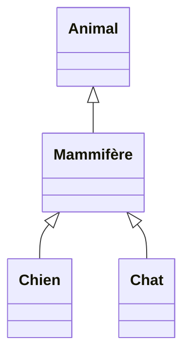
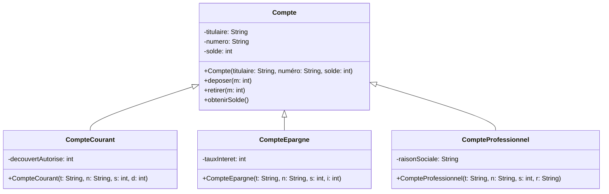

# L'héritage en programmation orientée objet

## Les origines : Simula 67 (1967)

L'héritage est né d'un besoin concret de réutilisation de code dans les simulations. En 1967, Ole-Johan Dahl et Kristen Nygaard ont présenté un concept permettant de spécifier des objets appartenant à différentes classes mais ayant des propriétés communes. Ces propriétés communes étaient regroupées dans une superclasse, et chaque superclasse pouvait elle-même avoir une superclasse (voir [la page Wikipedia dédiée](https://en.wikipedia.org/wiki/Simula) ou un [historique du langage Simula](https://users.dcc.uchile.cl/~cgutierr/cursos/LP/SimulaHistory.html) écrit par Jan Rune Holmevik).

## La raison d'être

L'**héritage** est un mécanisme qui permet à une classe (appelée **sous-classe** ou **classe dérivée**) de récupérer automatiquement les attributs et méthodes d'une autre classe (appelée **superclasse** ou **classe de base**).

Si la classe B hérite de la classe A, alors on peut écrire que **`B est un A`**. Par exemple :
* Mammifère **est un** type d'animal
* Chien **est un** type de mammifère
* Chat **est un** type de mammifère

Ces relations **est un** entre les classes permettent d'exprimer une **hiérarchie de classe**, c'est à dire un arbre dans lequel les noeuds sont les classes et les arcs orientés la relation **est un**. On utilise les diagrammes de classes UML pour représenter cela :

L'héritage permet aux programmeurs de créer des classes qui sont construites sur des classes existantes, de spécifier une nouvelle implémentation tout en maintenant les mêmes comportements, de réutiliser du code et d'étendre de manière indépendante un logiciel via des classes et interfaces publiques.

Reprenons l'exemple des comptes bancaires. Supposons qu'il existe différents types de comptes :

* Le compte courant : Celui sur lequel on retire de l'argent, qui peut avoir un découvert autorisé.
* Le compte d'épargne : Un compte qui n'autorise pas de découvert, sur lequel on va placer de l'argent qui sera rémunéré par un taux d'intérêt.
* Le compte professionnel : à destination d'une entreprise, il référence la raison social de cette entreprise.

Tous ces comptes partagent aussi des informations communes :

* Une indication de leur titulaire
* Un numéro de compte
* Un solde

En plus de cela, on aimerait pouvoir faire des opérations sur tous ces comptes :

* Retirer une somme d'argent
* Déposer une somme d'argent
* consulter le solde

On cherche à représenter ces informations de sorte à faire apparaitre et à pouvoir exploiter les relation de type **est un**. Par exemple qu'un compte courant **est un** type de compte. On va utiliser pour cela la notion d'héritage que nous illustrons avec le diagramme de classe UML suivant :

<i>Hiérarchie de comptes bancaires</i>

Vous pouvez constater que les constructeurs des sous-classes reprennent les arguments de la super-classe Compte en y ajoutant à chaque fois un paramètre pour initialiser l'attribut qui leur est propre.

XXX Donner le code constructeur, surcharger une méthode (ex: obtenir solde... ?) expliquer usage de super...

## Les bénéfices de l'héritage

1. **Réutilisation du code** : Pas besoin de réécrire `deposer()`, `afficherInfos()`, etc. pour chaque type de compte.

2. **Extension facile** : Pour ajouter un nouveau type de compte (par exemple, `CompteJeune`), il suffit d'étendre `Compte` et de redéfinir les méthodes spécifiques.

3. **Maintenance simplifiée** : Si on doit changer la logique de `deposer()`, on ne la modifie qu'à un seul endroit : dans la classe `Compte`.

4. **Polymorphisme** : On peut traiter tous les comptes de manière uniforme via le type `Compte`, tout en conservant leurs comportements spécifiques.

## ## Conclusion

L'héritage est un outil puissant inventé dans les années 1960 pour résoudre le problème de la duplication de code dans les systèmes de simulation. Simula 67 a introduit tous les éléments aujourd'hui considérés comme essentiels dans un langage orienté objet : encapsulation, héritage, liaison tardive, et création dynamique d'objets [1].

Cependant, l'expérience de 50+ années de programmation orientée objet a montré que l'héritage doit être utilisé avec précaution :
- **Excellent** pour modéliser des relations "est-un" stables et claires
- **Problématique** quand utilisé simplement pour réutiliser du code
- **Souvent remplaçable** par la composition, qui offre plus de flexibilité

La règle moderne : **"Favoriser la composition plutôt que l'héritage, sauf quand la relation 'est-un' est évidente et stable"**.

---

## Références

[1] **Wikipedia - Simula**  
"Class and inheritance concepts - Simula 67"  
https://en.wikipedia.org/wiki/Simula

[2] **Wikipedia - Inheritance (object-oriented programming)**  
"Definition and fundamental principle of inheritance"  
https://en.wikipedia.org/wiki/Inheritance_(object-oriented_programming)

[3] **Wikipedia - Fragile base class**  
"The fragile base class problem in implementation inheritance"  
https://en.wikipedia.org/wiki/Fragile_base_class

[4] **Design Patterns: Elements of Reusable Object-Oriented Software**  
Gamma, E., Helm, R., Johnson, R., & Vlissides, J. (1994)  
"Favor object composition over class inheritance"

[5] **James Gosling on Java**  
Diverses interviews et conférences où James Gosling a exprimé ses réserves sur l'héritage d'implémentation
